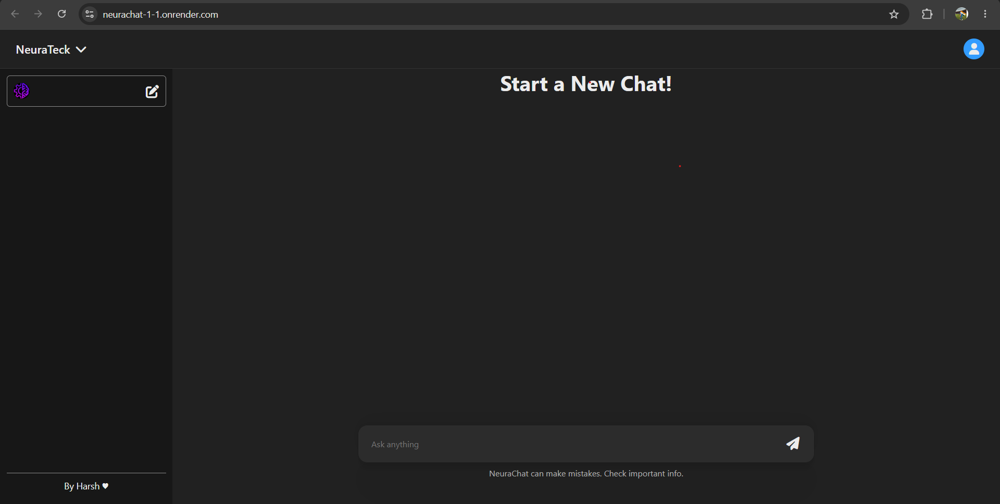
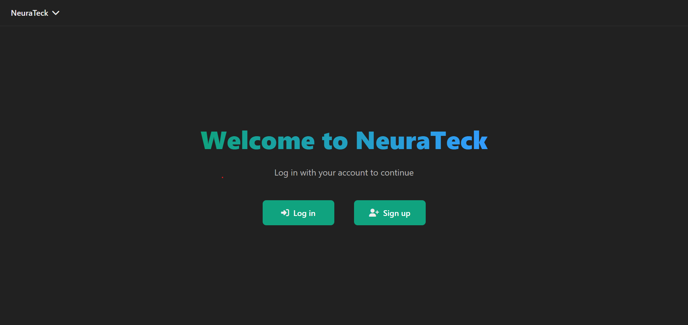
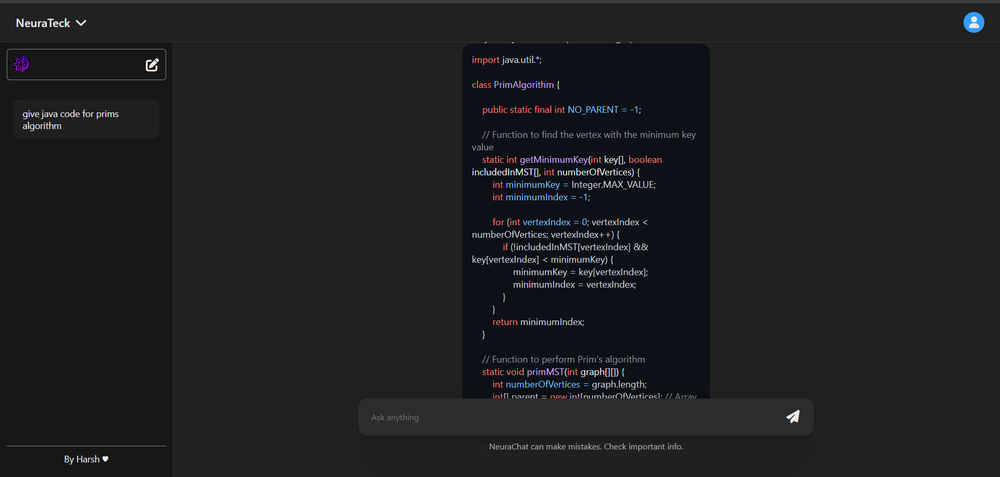

# 🚀 NeuraTeck – AI-Powered Conversational Platform

NeuraTeck is a full-stack AI-powered web application that enables users to interact with advanced AI models through a modern chat interface. Built using the MERN stack and integrated with OpenRouter AI, the platform provides intelligent conversations, persistent chat history, secure authentication, and scalable backend architecture.

---

## 🌐 Live Demo

🔗 **Frontend:** https://neurachat-1-1.onrender.com/

🔗 **Backend API:** https://neurachat-1-e7ck.onrender.com

---

## 📸 Project Preview

### 🏠 Landing Page



### 🔐 Authentication



### 🤖 AI Chat



## ✨ Features

### 🤖 AI-Powered Conversations

* Real-time AI responses using OpenRouter API
* Natural language interaction
* Fast and responsive chat experience

### 🔐 Secure Authentication

* JWT-based Authentication
* User Signup & Login
* Protected API Routes
* Secure session management

### 💬 Conversation Management

* Thread-based chat organization
* Persistent chat history
* Create and continue conversations
* Store messages in MongoDB

### ⚡ Modern User Experience

* ChatGPT-inspired UI
* Responsive design
* Real-time interaction
* Clean and intuitive interface

---

## 🏗️ System Architecture

```text
React Frontend
       │
       ▼
Express REST API
       │
       ▼
Authentication Layer (JWT)
       │
       ▼
MongoDB Database
       │
       ▼
OpenRouter AI Models
```

---

## 🛠️ Tech Stack

### Frontend

* React.js
* JavaScript
* HTML5
* CSS3
* Axios
* Context API

### Backend

* Node.js
* Express.js
* JWT Authentication
* bcrypt.js
* REST APIs

### Database

* MongoDB
* Mongoose

### AI Integration

* OpenRouter API

### Deployment

* Render
* Vercel

---

## 📂 Project Structure

```text
NeuraTeck/
│
├── Frontend/
│   ├── src/
│   ├── public/
│   └── package.json
│
├── Backend/
│   ├── routes/
│   ├── models/
│   ├── middlewares/
│   ├── utils/
│   └── server.js
│
└── README.md
```

---

## 🚀 Getting Started

### Clone Repository

```bash
git clone https://github.com/yourusername/NeuraTeck.git

cd NeuraTeck
```

### Backend Setup

```bash
cd Backend

npm install

npm run dev
```

### Frontend Setup

```bash
cd Frontend

npm install

npm run dev
```

---

## 🔑 Environment Variables

Create a `.env` file in Backend:

```env
PORT=8080

MONGODB_URI=your_mongodb_uri

JWT_SECRET=your_secret_key

OPENROUTER_API_KEY=your_api_key
```

---

## 📈 Engineering Highlights

* JWT-based Authentication System
* RESTful API Architecture
* MongoDB Data Persistence
* AI Integration with OpenRouter
* Protected Routes & Middleware
* Thread-based Chat Management
* Scalable MERN Stack Architecture

---

## 🎯 What I Learned

* Designing scalable REST APIs
* Implementing JWT Authentication
* Building AI-integrated applications
* Managing state in React
* Database schema design using MongoDB
* Secure backend development practices
* Full-stack deployment workflows

---

## 🚀 Future Enhancements

* Google Authentication
* Chat Search Functionality
* Multi-AI Model Support
* Voice-based Conversations
* AI Image Generation
* Real-time Streaming Responses
* Docker & Kubernetes Deployment

---

## 👨‍💻 Author

**Harsh Jadhav**

🔗 LinkedIn: https://www.linkedin.com/in/harsh-jadhav-dev

🔗 GitHub: https://github.com/Harshjadhav003

---

## ⭐ Support

If you found this project useful, consider giving it a ⭐ on GitHub.

---

## 📌 Disclaimer

This project is built for educational and portfolio purposes to demonstrate full-stack development, AI integration, authentication, and scalable backend architecture.
